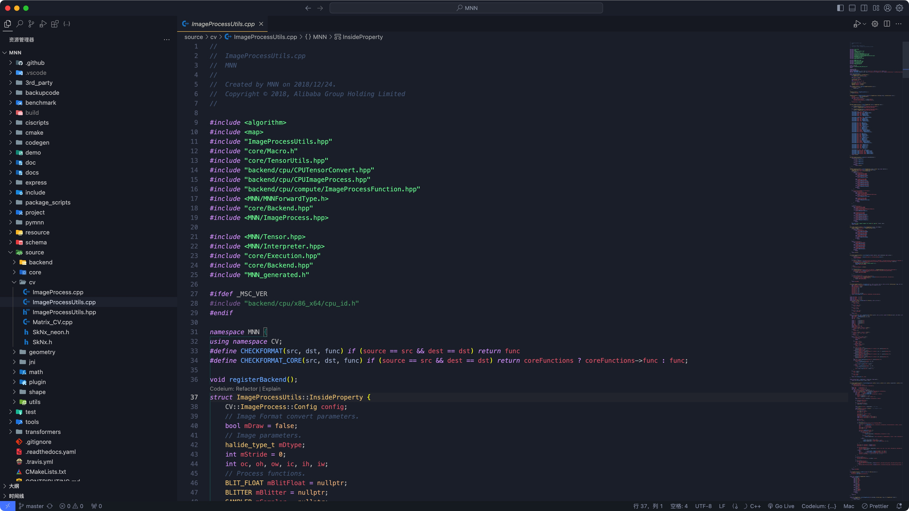
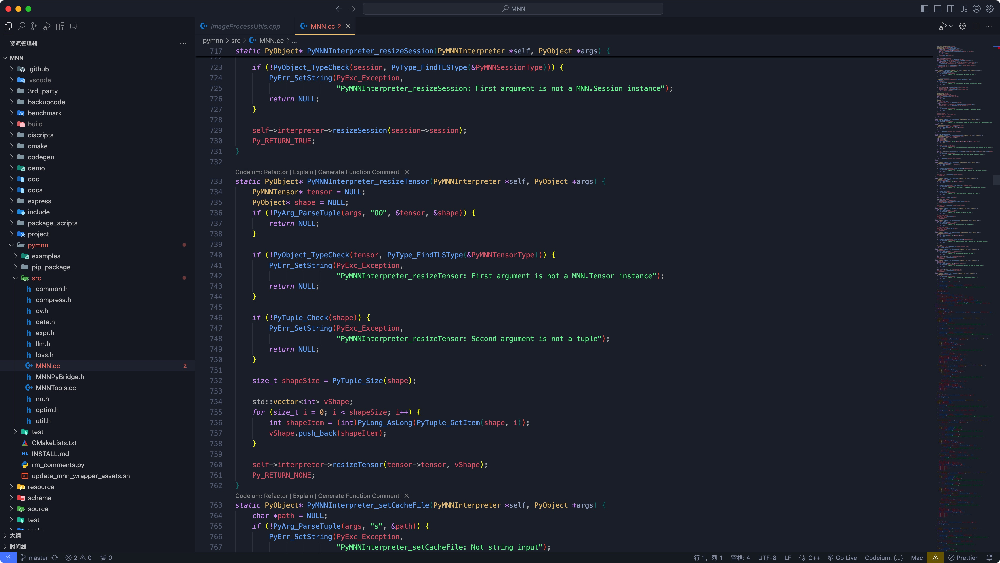

# Better One Dark Vivid Theme For VSCode 

## Overview
Better One Dark Vivid is a vibrant and visually appealing theme for Visual Studio Code, inspired by the popular One Dark theme. It offers a high contrast and colorful experience that enhances code readability and overall user experience.

## Features
- **High Contrast**: Easy on the eyes with clear distinctions between different elements.
- **Colorful**: Enhanced color coding for better identification of syntax and structure.
- **Customizable**: Allows for easy adjustments to suit personal preferences.

## Installation

VSCode [Marketplace](https://marketplace.visualstudio.com/items?itemName=devzhaoyou.better-one-dark-vivid-theme) 

Or :

To install the OneDark Vivid theme, follow these steps:

1. Open Visual Studio Code.
2. Go to the Extensions view by clicking on the Extensions icon in the Activity Bar on the side of the window.
3. Search for "Better One Dark Vivid" in the search bar.
4. Click the Install button for the Better One Dark Vivid theme.
5. Once installed, click the gear icon in the lower left corner of the VS Code window to open Settings.
6. Select "Color Theme" from the dropdown menu.
7. Choose "Better One Dark Vivid" from the list of available themes.

## Customization
The theme includes several settings that can be customized to your liking. You can adjust the colors, fonts, and other aspects to create a personalized coding environment.

## Contributing
If you'd like to contribute to the development of Better One Dark Vivid, please follow these guidelines:

1. Fork the repository on GitHub.
2. Make your changes in a new branch.
3. Submit a pull request with a description of your changes.

## License
This project is licensed under the [MIT License](LICENSE). Feel free to use, modify, and distribute the theme as you see fit.

## Support
If you encounter any issues or have suggestions for improvements, please open an issue on the [GitHub repository](https://github.com/jaaronkot/better-one-dark-vivid/issues).

## Acknowledgements
Thank you to all the contributors and users who have supported the development of Better One Dark Vivid. Your feedback and contributions are invaluable.
